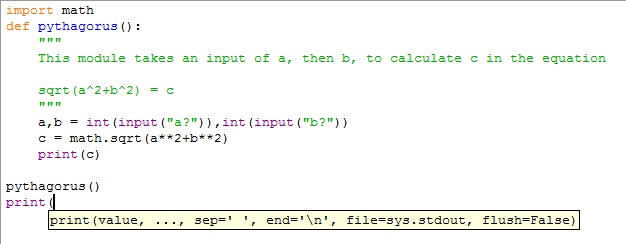
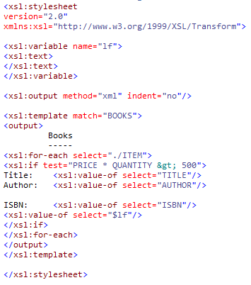
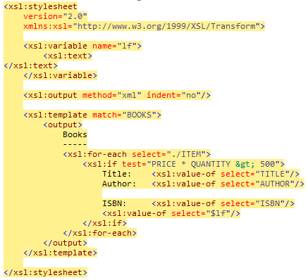
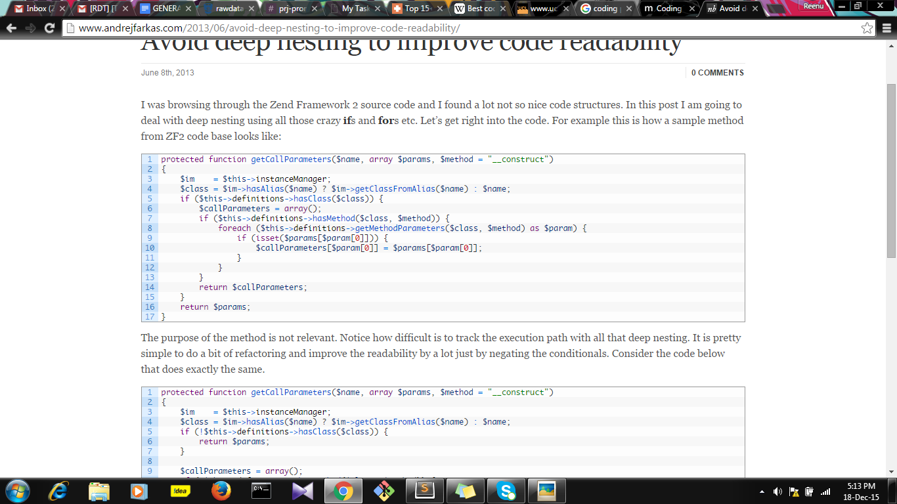
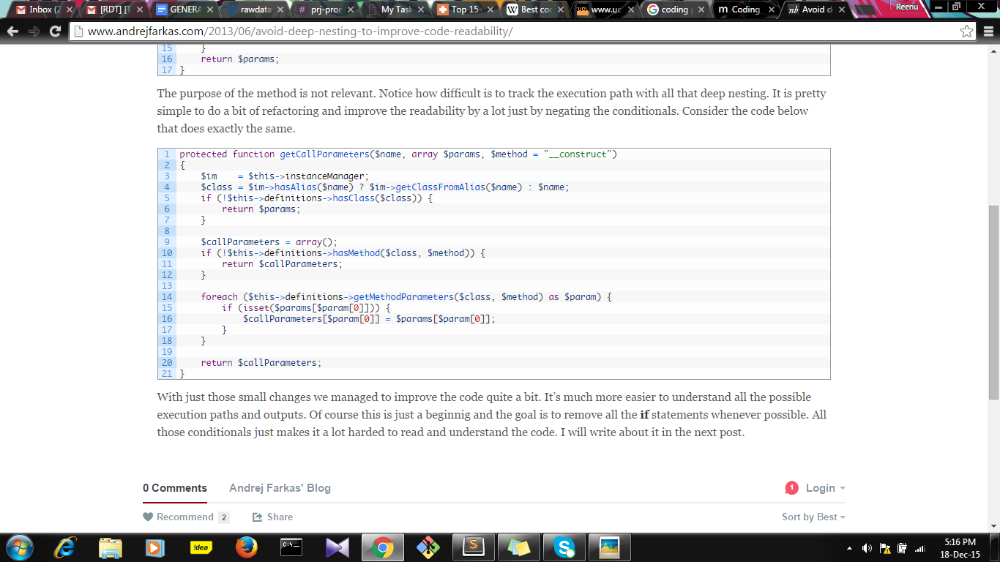

# GENERAL CODING CONVENTIONS

In computer programming, a naming convention is a set of rules for choosing the character sequence to be used for identifiers which denote variables, types, functions, and other entities in source code and documentation.

Reasons for using a naming convention include the following: 

-   to reduce the effort needed to read and understand source code
-   to enhance source code appearance
-   to give information about whether the identifier is a classname, variable, function, etc.
-   to enable code reviews to focus on more important issues than arguing over syntax and naming standards

## Readability

Hidden from the view of most users, well-chosen identifiers make it significantly easier for developers and analysts to understand what the system is doing and how to fix or extend the source code to apply for new needs.

For example, although the statement

-   a = b \* c;

is syntactically correct, its purpose is not evident. Contrast this with:

-   weekly\_pay = hours\_worked \* pay\_rate;

which implies the intent and meaning of the source code, at least to those familiar with the context of the statement.

## Length of identifiers

Fundamental elements of all naming conventions are the rules related to identifier length. Identifier length rules are subject to much debate academically.

Some considerations:

-   shorter identifiers may be preferred as more expedient, because they are easier to type
-   extremely short identifiers (such as 'i' or 'j') are very difficult to uniquely distinguish using automated search and replace tools
-   longer identifiers may be preferred because short identifiers cannot encode enough information or appear too cryptic
-   longer identifiers may be disfavored because of visual clutter

## Naming conventions

The following are some specific conventions that’s considered important. (\*Note: examples are explained in context of python language)

-   Variables represent objects in the real world, so they should be named with a noun. Every variable name should be "obvious" in the sense that it should convey the purpose of the variable in a way that's readable and understandable. Ask yourself "what does this variable represent in terms of the larger problem I'm trying to solve?" The answer to that question is the name of the variable.

<!-- -->

-   eg: to represent first name and last name of a user 

<!-- -->

-   fn and ln 
-   first and last
-   go for first\_name and last\_name (use letter cases according to the specific language)

<!-- -->

-   Types represent categories of objects in the real world, so they, too, should be named with a noun.
-   Functions and methods represent actions in the real world, so they should be named with a verb.

<!-- -->

-   eg: for a function to print details of a user

<!-- -->

-   go for print(), print\_details(), etc.

<!-- -->

-   Booleans should have an "is", "has", "must be" or something alike in their names. This is true for both boolean variables and functions/methods returning booleans.

<!-- -->

-   eg: to represent a boolean variable which denotes whether the user is a student or not

<!-- -->

-   student 
-   go for is\_student

<!-- -->

-   Class names too should be named with a noun.

<!-- -->

-   eg: a class to represent students  

<!-- -->

-   go for Student

<!-- -->

-   Don't encode types in names. Over the course of a decade of adding features and fixing bugs, types often change. It's clumsy, error-prone, and often quite impossible to change variable names accordingly.
-   Avoid abbreviations except where they are really obvious and very common. 

<!-- -->

-   eg: to represent file id 

<!-- -->

-   fid, fi
-   file\_id

\*Note: The exact rules of a naming convention depend on the context in which they are employed (eg: language dependent). Nevertheless, there are several common elements that influence most if not all naming conventions in common use today.

Example: Python naming conventions

Names to Avoid

-   single character names except for counters or iterators
-   dashes (-) in any package/module name
-   \_ \_double\_leading\_and \_trailing\_underscore\_ \_ names (reserved by Python)

Naming Convention

-   "Internal" means internal to a module or protected or private within a class.
-   Prepending a single underscore (\_) has some support for protecting module variables and functions (not included with import \* from). Prepending a double underscore (\_\_) to an instance variable or method effectively serves to make the variable or method private to its class (using name mangling).
-   Place related classes and top-level functions together in a module. Unlike Java, there is no need to limit yourself to one class per module.
-   Use CapWords for class names, but lower\_with\_under.py for module names. Although there are many existing modules named CapWords.py, this is now discouraged because it's confusing when the module happens to be named after a class. 

Guidelines derived from Guido's Recommendations

<table>
<colgroup>
<col width="33%" />
<col width="33%" />
<col width="33%" />
</colgroup>
<tbody>
<tr class="odd">
<td align="left">
Type
</td>
<td align="left">
Public
</td>
<td align="left">
Internal
</td>
</tr>
<tr class="even">
<td align="left">
Packages
</td>
<td align="left">
lower_with_under
</td>
<td align="left">

</td>
</tr>
<tr class="odd">
<td align="left">
Modules
</td>
<td align="left">
lower_with_under
</td>
<td align="left">
_lower_with_under
</td>
</tr>
<tr class="even">
<td align="left">
Classes
</td>
<td align="left">
CapWords
</td>
<td align="left">
_CapWords
</td>
</tr>
<tr class="odd">
<td align="left">
Exceptions
</td>
<td align="left">
CapWords
</td>
<td align="left">

</td>
</tr>
<tr class="even">
<td align="left">
Functions
</td>
<td align="left">
lower_with_under()
</td>
<td align="left">
_lower_with_under()
</td>
</tr>
<tr class="odd">
<td align="left">
Global/Class Constants
</td>
<td align="left">
CAPS_WITH_UNDER
</td>
<td align="left">
_CAPS_WITH_UNDER
</td>
</tr>
<tr class="even">
<td align="left">
Global/Class Variables
</td>
<td align="left">
lower_with_under
</td>
<td align="left">
_lower_with_under
</td>
</tr>
<tr class="odd">
<td align="left">
Instance Variables
</td>
<td align="left">
lower_with_under
</td>
<td align="left">
_lower_with_under (protected) or __lower_with_under (private)
</td>
</tr>
<tr class="even">
<td align="left">
Method Names
</td>
<td align="left">
lower_with_under()
</td>
<td align="left">
_lower_with_under() (protected) or __lower_with_under() (private)
</td>
</tr>
<tr class="odd">
<td align="left">
Function/Method Parameters
</td>
<td align="left">
lower_with_under
</td>
<td align="left">

</td>
</tr>
<tr class="even">
<td align="left">
Local Variables
</td>
<td align="left">
lower_with_under

</td>
<td align="left">

</td>
</tr>
</tbody>
</table>

Best Practices for Writing Super Readable Code
===============================================================================

Best coding practices are a set of informal rules that the [software development](https://www.google.com/url?q=https://en.wikipedia.org/wiki/Software_development&sa=D&usg=AFQjCNEQMJsX2FveLAFx5GE1ej-MpkGirg) community has learned over time which can help improve the quality of software. Many computer programs remain in use for far longer than the original authors ever envisaged, so any rules need to facilitate both initial development and subsequent maintenance and enhancement by people other than the original authors. A few best practises can be seen as:

-   Commenting and Documentation
    ----------------------------------------------------

<!-- -->

-   Software documentation exists in two forms, external and internal. External documentation is maintained outside of the source code, such as specifications, help files, and design documents. Internal documentation is composed of comments that developers write within the source code at development time. commenting can decrease the cost of knowledge transfer between developers working on the same module.

-   Avoid Obvious Comments
    ----------------------------------------------

// get the country code

$country\_code = get\_country\_code($\_SERVER\['REMOTE\_ADDR'\]);

 

// if country code is US

if ($country\_code == 'US') {

 

    // display the form input for state

    echo form\_input\_state();

}

-   Consistent Indentation

<!-- -->

-   Indent code to better convey the logical structure of your code. Without indenting, code becomes difficult to follow.
-   code with no indentation

-   properly indented code

-   Consistent Naming Scheme
    ------------------------------------------------

<!-- -->

-   Use of proper naming conventions is considered good practice.

<!-- -->

-   Consistent Temporary Names

<!-- -->

-   Normally, the variables should be descriptive and contain one or more words. But, this doesn't necessarily apply to temporary variables. They can be as short as a single character. It is a good practice to use consistent names for your temporary variables that have the same kind of role.

<!-- -->

-   Code Grouping
    -------------------------------------

<!-- -->

-   More often, certain tasks require a few lines of code. It is a good idea to keep these tasks within separate blocks of code, with some spaces between them. Use empty lines to provide organisational clues to source code, blocks (“paragraphs”-like structure) help the reader in comprehending the logical segmentation.

<!-- -->

-   DRY Principle
    -------------------------------------

<!-- -->

-   DRY stands for Don't Repeat Yourself. Dry aims at reducing repetition of same codes throughout the program.

<!-- -->

-   Avoid Deep Nesting
    ------------------------------------------

<!-- -->

-   Too many levels of nesting can make code harder to read and follow.
-   deep nested code (complicated…!!!!!)

-   same code after a bit of refactoring, with no deep nesting (much simpler to understand..!!!!)

-   Limit Line Length
    -----------------------------------------

<!-- -->

-   Establish a maximum line length for comments and code to avoid having to scroll the window of the text editor 

<!-- -->

-   File and Folder Organization
    ----------------------------------------------------

<!-- -->

-   Arrange and separate your source code logically between files. Technically, you could write an entire application code within a single file. But that would prove to be a nightmare to read and maintain. One of the best approaches is to either [use a framework](https://www.google.com/url?q=http://net.tutsplus.com/sessions/codeigniter-from-scratch/&sa=D&usg=AFQjCNEwbaworSsQzN8G0DWyJ3ZnZEna0Q), or imitate their folder structure. 

<!-- -->

-   eg: using Django web framework for web development using python.

<!-- -->

-   Read Open Source Code
    ---------------------------------------------

<!-- -->

-   Open Source projects are built with the input of many developers. These projects need to maintain a high level of code readability so that the team can work together as efficiently as possible. Therefore, it is a good idea to browse through the source code of these projects to observe what these developers are doing.

<!-- -->

-   Code Refactoring
    ----------------------------------------

<!-- -->

-   When you "refactor," you make changes to the code without changing any of its functionality. You can think of it like a "clean up," for the sake of improving readability and quality.

<!-- -->

-   Make use of IDE’s (Integrated Development Environment)
    ----------------------------------------------------------------------------------------------------------

<!-- -->

-   Use freely available IDE’s for development. An IDE normally consists of a source code editor, build automation tools and a debugger. 
    --------------------------------------------------------------------------------------------------------------------------------------------------------------------------------------------------------------------------------------------------------

<!-- -->

-   Eg: Sublime for python programming.
    ------------------------------------------------------------

Source

1.  [https://en.wikipedia.org/wiki/Naming\_convention\_(programming)](https://www.google.com/url?q=https://en.wikipedia.org/wiki/Naming_convention_(programming)&sa=D&usg=AFQjCNHbjLJ8rxezOSBs5l72T1eCZfPOPA)
2.  [https://google.github.io/styleguide/pyguide.html](https://www.google.com/url?q=https://google.github.io/styleguide/pyguide.html&sa=D&usg=AFQjCNEsziggA7GYqug0sHpEB3o1h8FXuQ)
3.  [http://programmers.stackexchange.com/questions/33532/naming-conventions-for-variables](https://www.google.com/url?q=http://programmers.stackexchange.com/questions/33532/naming-conventions-for-variables&sa=D&usg=AFQjCNHHWojtAA3qjrqMLTgrQZhIZmUOLQ)
4.  [http://code.tutsplus.com/tutorials/top-15-best-practices-for-writing-super-readable-code--net-8118](https://www.google.com/url?q=http://code.tutsplus.com/tutorials/top-15-best-practices-for-writing-super-readable-code--net-8118&sa=D&usg=AFQjCNE_9pVHJaWf8YKBeCbGavrTZBWlAg)
5.  [http://www.ucl.ac.uk/~ucappgu/seminars/good-practice.pdf](https://www.google.com/url?q=http://www.ucl.ac.uk/~ucappgu/seminars/good-practice.pdf&sa=D&usg=AFQjCNFQYuXFtT1H7hNrtKHtUINf6ZIhXQ)
6.  [http://www.andrejfarkas.com/2013/06/avoid-deep-nesting-to-improve-code-readability/](https://www.google.com/url?q=http://www.andrejfarkas.com/2013/06/avoid-deep-nesting-to-improve-code-readability/&sa=D&usg=AFQjCNEQ4qeDfneT9EZ6eOeceScuxlLc6w)

